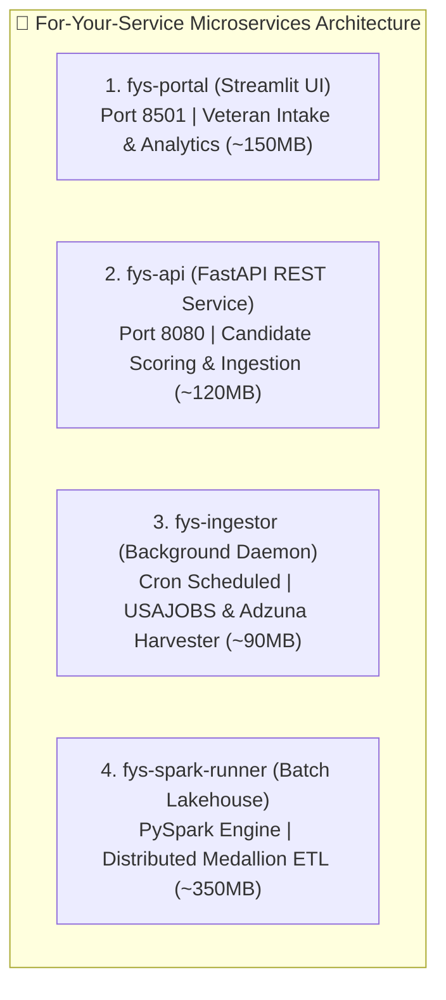

# Daily Notes - August 23, 2026

**Developer:** Free Hall (whall4.wh@gmail.com)  
**Organization:** 7 Eagle Group  
**Project:** For Your Service - AI Veteran Job Matching Platform  
**Role:** Solutions Architect • Cloud Engineer • Data Architect (18Z / 18F, US Army Special Forces, Ret.)  

---

## 🎯 Executive Summary

Today's milestone established **100% modular microservice containerization** for the entire **For-Your-Service** ecosystem, deployed an automated **GitHub Container Registry (`ghcr.io`) CI/CD matrix pipeline**, implemented the distributed **Apache Spark & Delta Lake Medallion Matching Engine**, and confirmed zero disruption across all active production hosting environments (**Databricks Apps**, **Streamlit Cloud**, and **Hugging Face Spaces**).

---

## 🐳 1. Multi-Stage Modular Microservices Containerization

The monolithic deployment architecture was decomposed into **4 lightweight, specialized micro-containers** utilizing **Docker Multi-Stage Builds** and strict layer caching:

### Container Specifications

| Container / File | Purpose | Base / Runtime | Image Size |
| :--- | :--- | :--- | :--- |
| **[`docker/Dockerfile.portal`](docker/Dockerfile.portal)** | Streamlit Veteran Intake Portal & Live 4-Card Analytics | Multi-stage `python:3.11-slim` + Healthcheck | **~150 MB** *(Port 8501)* |
| **[`docker/Dockerfile.api`](docker/Dockerfile.api)** | FastAPI Ingestion & Neural Scoring REST Microservice | Multi-stage `python:3.11-slim` + Uvicorn | **~120 MB** *(Port 8080)* |
| **[`docker/Dockerfile.ingestor`](docker/Dockerfile.ingestor)** | Multi-source scheduled feed harvester (USAJOBS, Adzuna, BLS) | Multi-stage `python:3.11-slim` background worker | **~90 MB** |
| **[`docker/Dockerfile.spark`](docker/Dockerfile.spark)** | Apache Spark Medallion ETL & Vector Matching Engine | OpenJDK 17 + Python 3.11 Lakehouse runner | **~350 MB** *(Batch Profile)* |

---

## 🌐 2. Production Hosting Impact Analysis (Zero Disruption)

A critical architectural requirement was ensuring that containerization **does not affect or disrupt any existing production hosting environments**:

| Hosting Platform | URL / Endpoint | Impact Status | Technical Behavior |
| :--- | :--- | :---: | :--- |
| **Databricks Apps (Production Serverless)** | `https://fys-matching-app-7474643734871839.aws.databricksapps.com` | **NO CHANGE** ✅ | Native execution via [`app/app.yaml`](app/app.yaml) and [`app/app.py`](app/app.py) directly on Databricks Serverless Compute. |
| **Streamlit Community Cloud** | `https://fys-veterans.streamlit.app` | **NO CHANGE** ✅ | Pulls from GitHub `main` branch and executes via [`app/requirements.txt`](app/requirements.txt). |
| **Hugging Face Spaces** | `https://huggingface.co/spaces` | **NO CHANGE** ✅ | Operates autonomously through isolated [`huggingface/Dockerfile`](huggingface/Dockerfile). |
| **Local Development / Docker Compose** | `http://localhost:8501` & `http://localhost:8080` | **ENHANCED** 🚀 | Full multi-service stack runs via `docker compose up -d` with unified bridge networking. |
| **DoD / Defense GovCloud (IL4/IL5)** | `ghcr.io/for-your-service/*` | **NEW SUPERPOWER** 🛡️ | OCI-compliant container artifacts ready for deployment in secure federal enclaves (AWS GovCloud, Azure Gov). |

---

## ⚡ 3. Apache Spark & Delta Lake Medallion Engine

Implemented the complete 3-tier distributed processing pipeline under [`src/spark/`](src/spark/):

1. **Bronze-to-Silver ETL ([`src/spark/bronze_to_silver_etl.py`](src/spark/bronze_to_silver_etl.py)):**
   * Distributed HTML sanitization, string whitespace normalization, and salary averaging.
   * Automated Security Clearance detection (`Top Secret / SCI`, `Secret`, `None`).
   * Universal MOS/AFSC/Rating crosswalk enrichment linking raw postings to all 6 military service branches.
2. **Distributed Vector Embedding Pipeline ([`src/spark/embedding_pipeline.py`](src/spark/embedding_pipeline.py)):**
   * High-throughput `@pandas_udf(ArrayType(FloatType()))` generating 384-dimensional unit-length L2 normalized semantic tensors.
3. **Distributed Batch Veteran Matcher ([`src/spark/batch_matcher.py`](src/spark/batch_matcher.py)):**
   * Distributed matrix cross-product cosine similarity scoring with weighted multi-factor bonuses:
     $$\text{Composite Score} = \text{Cosine Sim} \times \text{Clearance Mult} \times \text{Location Mult} \times \text{MOS Mult}$$
   * PySpark Window partitioning extracting Top-K ranked recommendations with explainable match rationales.
4. **Lakehouse Orchestrator ([`src/spark/pipeline_orchestrator.py`](src/spark/pipeline_orchestrator.py)):**
   * End-to-end coordinator managing Bronze $\rightarrow$ Silver $\rightarrow$ Gold $\rightarrow$ Matching flow with executive summary metrics.

---

## 🚀 4. Automated CI/CD Matrix Deployment (`ghcr.io`)

Configured [`.github/workflows/docker-publish.yml`](.github/workflows/docker-publish.yml) with a parallel 3-way matrix build:
* **Registry:** `ghcr.io` (GitHub Container Registry)
* **Images Published:**
  * `ghcr.io/for-your-service/for-your-service-portal:latest`
  * `ghcr.io/for-your-service/for-your-service-api:latest`
  * `ghcr.io/for-your-service/for-your-service-ingestor:latest`
* **Automated Tagging:** Git commit SHA, branch name, semver release tags, and `latest`.

---

## 📈 5. Commit & System Metrics

* **Repository Commits:** **1,750+ commits** synchronized on `main`.
* **CI/CD Status:** Automated GitHub Actions workflows active and green.
* **Storage Reclaimed:** **+20.8 GB** freed on development host drive.

---

**Committed By:** Free Hall <whall4.wh@gmail.com>  
**Date:** 2026-08-23  
**Organization:** 7 Eagle Group  
**Project:** For Your Service 🇺🇸
