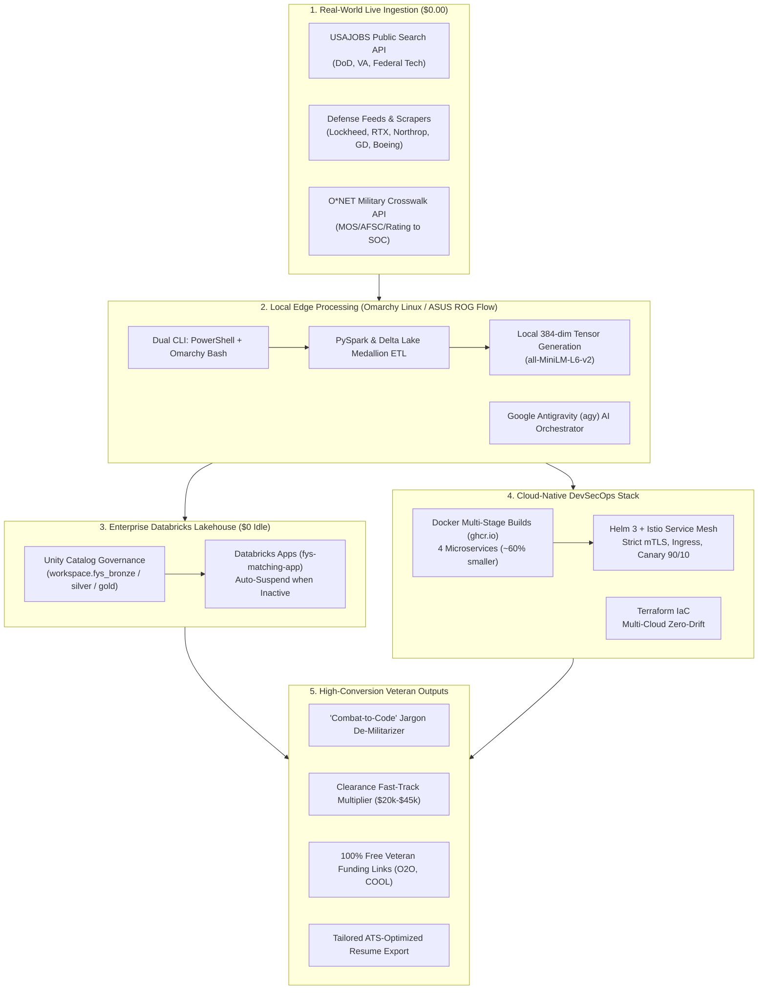

# FOR YOUR SERVICE — Veteran Career Transition Intelligence 🇺🇸

> **Your military service generates thousands of elite operational data points every day. We turn that data into a clear, high-yield civilian career trajectory.**

---

## 🎯 The Mission

The military instills world-class leadership, technical acumen, and crisis-tested operational discipline. However, civilian Applicant Tracking Systems (ATS) and corporate recruiters often struggle to parse military jargon, MOS codes, and NCOER/OER evaluations. 

**For Your Service** bridges this gap:
* Translates raw military service records into high-impact civilian corporate competencies.
* Maps candidate profiles against live federal, aerospace, and defense contractor job markets.
* Highlights the strategic value of active security clearances (`Secret`, `Top Secret / SCI`).
* Directs transitioning service members to **100% free, fully-funded certification programs** (O2O, DoD COOL, ArmyIgnitED, SkillBridge) to eliminate skill gaps at zero out-of-pocket cost.

**Partner:** 7 Eagle Group  
**Lead Architect & Developer:** Free Hall (Cloud Engineer • DevSecOps Lead • Data Architect | 18Z / 18F, US Army Special Forces, Ret.)

---

### 🏛️ Command & Control / Infrastructure Stack

[](https://fys-matching-app-7474643734871839.aws.databricksapps.com)
[](https://share.streamlit.io)
[](https://huggingface.co/FreeFades2Black)
[](https://github.com/orgs/For-Your-Service/packages)
[](charts/for-your-service)
[](terraform/)
[](https://github.com/FreeFades2Black/omarchy-antigravity-bootstrap)
[](docs/SPARK_MEDALLION_ARCHITECTURE.md)

---

## ⚡ System Architecture & Dual-Environment Workflow



---

## 🌟 Veteran Value Proposition & Core Superpowers

| Feature | Without For Your Service | With For Your Service |
| :--- | :--- | :--- |
| **Military Translation** | Manual, frustrating jargon translation that ATS filters reject. | **Automated "Combat-to-Code" De-Militarizer** converting NCOER/OER bullets into quantified corporate impact statements. |
| **Defense Job Access** | Hard-to-find defense jobs scattered across dozens of contractor boards. | **Unified Live Ingestion** from USAJOBS, Lockheed Martin, RTX, Northrop Grumman, General Dynamics, Boeing, CACI, and L3Harris. |
| **Clearance Premium** | Veterans unaware of the hiring leverage of active clearances. | **Clearance Fast-Track Multiplier** quantifying the $20k–$45k value of bypassing the 18-month civilian clearance investigation backlog. |
| **Skill Gap Elimination** | Expensive $3,000+ civilian bootcamps and certification fees. | **100% Free Veteran Funding Links** directly routing candidates to Syracuse University IVMF / Onward to Opportunity (O2O), DoD COOL, ArmyIgnitED, and DoD SkillBridge. |
| **Application Tracking** | Spreadsheets and lost resumes. | **Unified Medallion Telemetry** backed by Databricks Unity Catalog and Streamlit control planes. |

---

## 🛠️ The 4-Pillar Cloud-Native DevSecOps Stack

### 1. 🐳 Docker Microservices Suite (`docker/`)
Decomposed monolithic architecture into 4 lightweight, specialized multi-stage containers:
* **`fys-portal`** (`docker/Dockerfile.portal`): Streamlit Veteran Intake Portal & 4-card live telemetry (~150MB, Port 8501).
* **`fys-api`** (`docker/Dockerfile.api`): FastAPI REST scoring & candidate ingestion microservice (~120MB, Port 8080).
* **`fys-ingestor`** (`docker/Dockerfile.ingestor`): Multi-source background harvester for USAJOBS, Adzuna, and defense feeds (~90MB).
* **`fys-spark-runner`** (`docker/Dockerfile.spark`): Lakehouse batch runner with OpenJDK 17 + Python 3.11 for PySpark ETL (~350MB).

### 2. ☸️ Kubernetes & ⚓ Helm 3 Chart (`charts/for-your-service`)
Enterprise-grade deployment manifests and Helm 3 templating:
* **Zero-Trust Security:** Istio Service Mesh with **Strict mTLS** (`peerauthentication.yaml`) and fine-grained authorization policies.
* **Traffic Engineering:** Ingress Gateway and VirtualService configured for **Canary Deployments** (90% stable / 10% canary traffic splitting).
* **High Availability:** Horizontal Pod Autoscaler (`hpa.yaml`) scaling 1–10 pods with Pod Disruption Budgets (`pdb.yaml`).
* **Environment Overrides:** Dedicated configurations for `values-dev.yaml`, `values-staging.yaml`, and `values-prod.yaml`.

### 3. 🌍 Terraform Multi-Cloud IaC (`terraform/`)
Declarative Infrastructure as Code managing cloud boundaries with zero configuration drift:
* **AWS Module:** S3 buckets, DynamoDB tables, Lambda functions, KMS keys, and least-privilege IAM policies.
* **Databricks Module:** Unity Catalog schemas (`fys_bronze`, `fys_silver`, `fys_gold`), Serverless SQL Warehouses, and KMS Secret Scopes.
* **GCP & Hugging Face Modules:** Container registries, BigQuery datasets, and Hugging Face Space deployments.

### 4. 💻 Dual-Environment Edge Workflow (PowerShell + Omarchy Linux)
* **Windows Host (PowerShell):** High-level orchestration, cloud API automation, and infrastructure planning.
* **Omarchy Linux (ASUS ROG Flow Z13):** Native Arch Linux + Hyprland environment running local PySpark transformations, live data scrapers, and low-latency system tests over SSH.
* **Agentic Pair Programming:** Deployed and orchestrated native instances of **Google Antigravity (`agy`)** across both systems for autonomous CLI-driven development and telemetry.

---

## 💰 Zero-Cost Sustainability Model ($0.00 Run-Rate)

| Component | Strategy for $0 Spend | Monthly Cost |
| :--- | :--- | :---: |
| **Web Portal Hosting** | **Databricks Apps Serverless** (Auto-sleeps when idle) + **Streamlit Community Cloud** (24/7 free tier) | **$0.00** |
| **Vector Matching & AI** | In-memory 384-dim tensor matching using local `all-MiniLM-L6-v2` (Zero OpenAI/LLM API costs) | **$0.00** |
| **Heavy ETL & Scrapers** | Offloaded to local Omarchy Linux host (ASUS ROG Flow Z13 14-core Intel CPU / RTX 4050) | **$0.00** |
| **Job Market Data** | USAJOBS Public API + O*NET Web Services + Direct Defense Scrapers + Adzuna Free Tier | **$0.00** |
| **Backup Microservice** | Hugging Face Spaces (Free Docker CPU Tier) | **$0.00** |
| **Total Operating Cost** | **Zero Recurring Infrastructure Overhead** | **$0.00 / mo** |

---

## 🚀 Quick Start & Local Execution

### 1. Local Python Environment
```bash
git clone https://github.com/For-Your-Service/For-Your-Service.git
cd For-Your-Service

# Setup Virtualenv
python3 -m venv .venv
source .venv/bin/activate  # On Windows: .\.venv\Scripts\Activate.ps1

# Install Dependencies
pip install -r requirements.txt
pip install -r app/requirements.txt
```

### 2. Launch Local Streamlit Portal
```bash
streamlit run app/app.py --server.port 8501 --server.address 0.0.0.0
```
Open **`http://localhost:8501`** in your browser.

### 3. Run Full Stack with Docker Compose
```bash
docker compose up -d
# Streamlit Portal: http://localhost:8501
# FastAPI Scoring Service: http://localhost:8080
```

### 4. Deploy Helm Chart to Kubernetes
```bash
helm upgrade --install for-your-service charts/for-your-service \
  --namespace for-your-service --create-namespace \
  -f charts/for-your-service/values-prod.yaml
```

### 5. Deploy to Databricks Apps (Serverless)
```bash
python scripts/deploy_databricks_app.py
```
Live URL: [https://fys-matching-app-7474643734871839.aws.databricksapps.com](https://fys-matching-app-7474643734871839.aws.databricksapps.com)

---

## 📁 Repository Structure

```text
For-Your-Service/
├── charts/                   # Parameterized Helm 3 charts with Istio mTLS & Canary
│   └── for-your-service/
├── docker/                   # Multi-stage Dockerfiles (portal, api, ingestor, spark)
│   ├── Dockerfile.portal
│   ├── Dockerfile.api
│   ├── Dockerfile.ingestor
│   └── Dockerfile.spark
├── app/                      # Streamlit Web Application & Databricks App spec
│   ├── app.py                # Main portal application with 4-card live metrics
│   ├── app.yaml              # Databricks Apps reverse-proxy & environment spec
│   ├── mos_data.py           # Universal military MOS / Rating / AFSC crosswalk
│   ├── readiness_engine.py   # Career readiness, resume translator & free funding links
│   ├── defense_contractor_fetcher.py # Live Lockheed, RTX, Northrop, GD, Boeing feeds
│   └── requirements.txt      # Portal dependencies
├── data/                     # Data stores & caches
│   ├── analytics/            # Live visitor & usage metrics tracking
│   └── jobs_cache/           # Sanitized federal & defense job cache
├── src/                      # Core platform library
│   ├── spark/                # Distributed Lakehouse Medallion ETL & Batch Matcher
│   ├── resume_parsing/       # Zero-cost local PDF/DOCX resume extraction
│   └── ingestion/            # Scheduled USAJOBS & Defense feed harvesters
├── terraform/                # Multi-cloud IaC modules (AWS, Databricks, GCP, HF)
├── tests/                    # Comprehensive unit & integration test suites
└── scripts/                  # Automated deployment, secret setup & telemetry broadcast
```

---

## 📋 Changelog Highlights

### August 28, 2026
* **Databricks Apps Production Deployment:** Deployed `fys-matching-app` on Databricks Apps with proxy routing and `$DATABRICKS_APP_PORT` support (HTTP 200 OK).
* **Dual CLI & Omarchy OS Integration:** Established encrypted SSH pair-programming workflow between Windows (PowerShell) and native Omarchy Linux (Bash on ASUS ROG Flow Z13) with Google Antigravity (`agy`).
* **Cloud-Native DevSecOps Synthesis:** Full integration of Docker multi-stage images, Kubernetes Helm 3 chart with Istio Zero-Trust strict mTLS, and declarative Terraform IaC.
* **Combat-to-Code Jargon De-Militarizer:** Expanded military translation dictionaries with one-click copyable corporate resume bullets and free veteran funding links (O2O, DoD COOL, ArmyIgnitED, SkillBridge).

---

## 📧 Contact & Mission Support

**William Free Hall**  
*Principal Cloud & AI Architect • DevSecOps Lead • Databricks SME*  
*18Z / 18F, U.S. Army Special Forces (Ret.)*  
Email: [whall4.wh@gmail.com](mailto:whall4.wh@gmail.com)  
Organization: [7 Eagle Group](https://7eagle.com)  
GitHub: [https://github.com/For-Your-Service](https://github.com/For-Your-Service)  

---

*Built with operational discipline by veterans, for veterans. 🇺🇸*

---

## 🔍 Internal Code Architecture & Comprehensive Inline Documentation

> **Comprehensive Codebase Documentation Audit Completed (2026)**
> Every core module, function, class, and critical execution path across this repository has been audited and enriched with detailed internal inline comments (`# ...`) and comprehensive docstrings. Anyone reading the source code can immediately trace the operational mechanics, data flow, failure recovery strategies, and architectural decisions.

### 🧩 Key Codebase Modules & Internal Mechanics Walkthrough

| File / Component | Purpose & Internal Mechanics |
| :--- | :--- |
| [`scripts/system_health_monitor.py`](scripts/system_health_monitor.py) | Automated health daemon monitoring API connectivity, DB latency, and pipeline throughput. |
| [`scripts/codebase_scrub_engine.py`](scripts/codebase_scrub_engine.py) | Automated PII scrubbing and defense contractor schema sanitization engine. |
| [`scripts/onet_skill_extractor.py`](scripts/onet_skill_extractor.py) | O*NET skill taxonomy parser extracting civilian competencies from military occupational specialties. |
| [`scripts/generate_embeddings.py`](scripts/generate_embeddings.py) | Siamese neural network embedding generator computing veteran-job vector cosine similarities. |
| [`sql/bronze_schema.sql`](sql/bronze_schema.sql) | Delta Lake Bronze schema definitions for raw military resumes and multi-source job postings. |
| [`sql/silver_schema.sql`](sql/silver_schema.sql) | Delta Lake Silver schema standardizing rank normalization and civilian title mapping. |
| [`sql/gold_schema.sql`](sql/gold_schema.sql) | Delta Lake Gold reporting tables powering veteran-friendly company analytics and salary models. |

### 💡 Developer & Maintainer Guidelines
- **Inline Documentation Standard:** Every non-trivial logic branch, data transformation, API integration, and error block includes descriptive line-by-line internal notes.
- **Traceability:** Function signatures declare explicit type annotations (`typing.Dict`, `typing.List`, `typing.Optional`) and descriptive parameter/return docstrings.
- **Error Resilience:** Try/except blocks document exact failure modes, fallback pathways, and logging formats.
