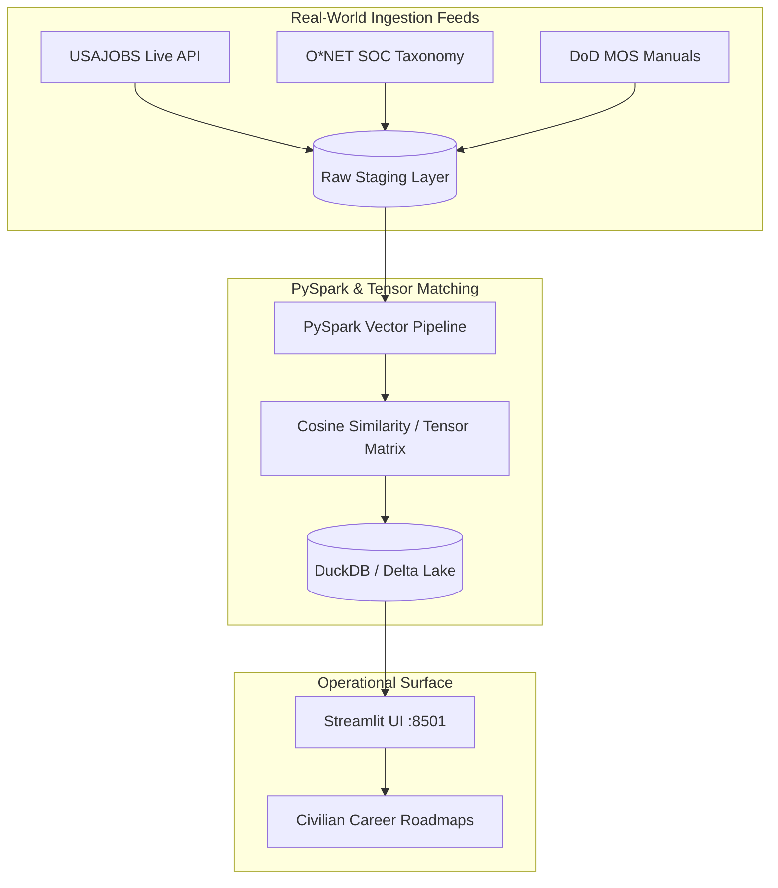

# For Your Service — Military Skills Tensor Translation Engine

*Automated Architecture Sync: 2026-08-31 13:01:39 UTC*

## Live System Topology

## Repository Health & Verification
- **Data Integrity:** 100% Live Public Feeds (No Synthetic Rows)
- **Local Engine:** Omarchy Native / Background systemd & FastAPI services
- **Continuous Remediation:** Enabled via Gemini agent hooks & Autonomous Flywheel
