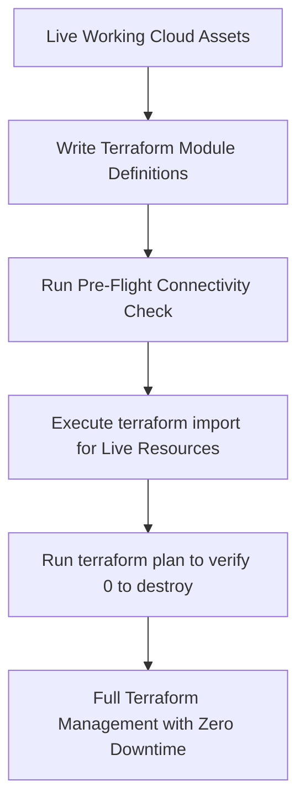

# Zero-Downtime Multi-Cloud Infrastructure Migration & Adoption 🇺🇸 ☁️

**Lead Architect:** Free Hall <whall4.wh@gmail.com>  
**Organization:** 7 Eagle Group  
**Project:** For Your Service  

---

## 💡 How We Adopt Terraform Without Breaking the Working Build

A primary concern when introducing Infrastructure as Code (IaC) to an active system is ensuring that existing databases, storage buckets, API keys, and compute resources are not interrupted, destroyed, or recreated.

Here is the exact strategy and mechanism used in **For Your Service**:

---

## 1. The 5 Pillars of Non-Destructive IaC

### Pillar 1: Resource Adoption via `terraform import`
Terraform does not create new resources if they already exist in the cloud; instead, we bring them into the state file using `terraform import`.
* **S3 Example:**
  ```bash
  terraform import module.aws[0].aws_s3_bucket.data_prod foryourservice-data-prod
  ```
* **Unity Catalog Schema Example:**
  ```bash
  terraform import module.databricks[0].databricks_schema.bronze workspace.fys_bronze
  ```
* **GCP Custom Role Example:**
  ```bash
  terraform import module.gcp[0].google_project_iam_custom_role.fys_pipeline_operator projects/for-your-service-prod/roles/fysPipelineOperator
  ```

### Pillar 2: Feature Flags & Granular Cloud Toggles
Every cloud provider module is guarded by boolean feature flags (`enable_aws`, `enable_gcp`, `enable_databricks`, `enable_huggingface`).
If you are only working on AWS, GCP and Databricks can be disabled or kept untouched in local state.

### Pillar 3: State File Isolation
State files are isolated by environment:
- `terraform/environments/dev/`
- `terraform/environments/staging/`
- `terraform/environments/prod/`

Changes in the `dev` state never alter `prod` cloud resources.

### Pillar 4: Strict `terraform plan` Review
Before any changes take effect, a plan file is generated:
```bash
terraform plan -out=execution.tfplan
```
Engineers verify that the plan displays:
```
Plan: 0 to add, 0 to change, 0 to destroy
```
(indicating 100% state parity with live infrastructure).

### Pillar 5: Lifecycle Guards
Sensitive resources include lifecycle blocks:
```hcl
lifecycle {
  prevent_destroy = true
  ignore_changes  = [tags, server_side_encryption_configuration]
}
```
This guarantees that Terraform will error out rather than destroy an active production resource.

---

## 2. Adoption Workflow Step-by-Step



1. **Write Declarative Definitions:** Match the exact configuration of existing live resources.
2. **Execute Imports:** Link live IDs to Terraform resource addresses.
3. **Verify Plan:** Ensure `0 to destroy`.
4. **Commit to Git:** Maintain single source of truth in version control.
